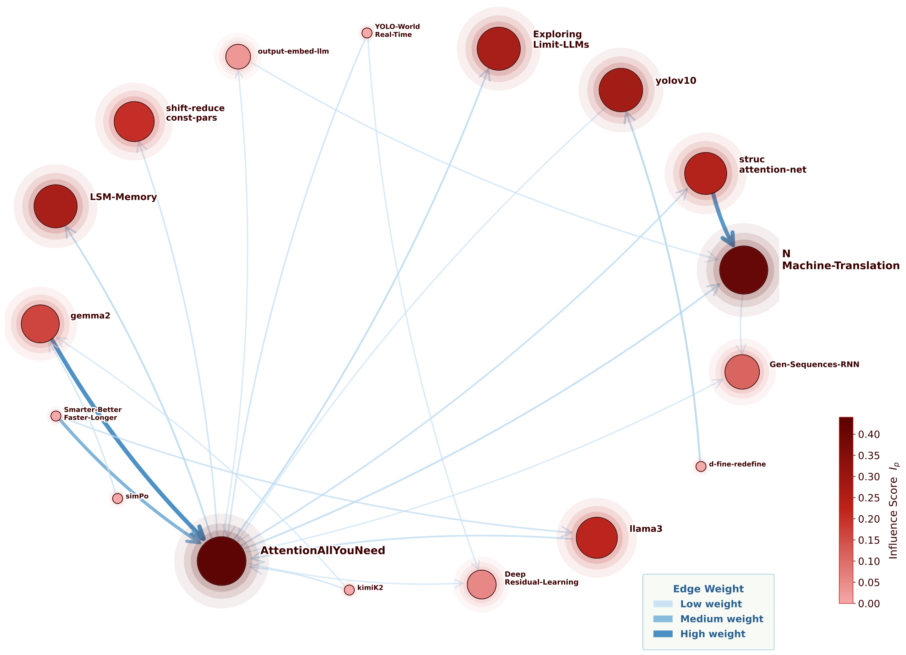

# Normalized Reference Scoring

This repository implements a two-stage pipeline for credit assignment in a
paper corpus:

1. score each paper internally at the section, paragraph, and citation levels
2. build an importance-weighted citation graph and propagate influence across
   the corpus

The anonymous copy intentionally omits cached result folders, old evaluation
artifacts, GitHub Pages files, and HTML exports. Those files are generated
locally when you run the commands below.

## Case-Study Network Figure



Full vector/PDF version: [citation_network_case1.pdf](citation_network_case1.pdf)

## Core Scores

For a paper `p`:

- `σ_tech(p)` is the paper's technical/originality score
- `W(p, q)` is the paper-level citation importance assigned from `p` to
  reference `q`

The cross-corpus quantities used by `run_knowledge_graph.py` are:

### Total Corpus-Level Contribution

```text
σ_P(p) = σ_tech(p) · (1 + Σ_paths a→p Π_edges W(u, v))
```

This is the Step 6 score. It keeps the paper's own technical contribution and
adds multiplicative influence propagated through citation paths from other
corpus papers.

### Propagated Cross-Paper Mass

```text
π_P(p) = σ_tech(p) · Σ_paths a→p Π_edges W(u, v)
```

This removes the paper's self-contribution and keeps only the part that arrives
through other papers in the corpus.

### Normalized Cross-Corpus Influence

```text
I_P(p) = π_P(p) / Σ_{p'} π_P(p')
```

This is the normalized influence share reported in Step 6. It answers:
"what fraction of all propagated cross-paper influence in the corpus ends at
paper `p`?"

### Source-Weighted Variant

Step 6B also reports a source-weighted alternative:

```text
σ_P^src(p) = σ_tech(p) + Σ_paths a→p σ_tech(a) · Π_edges W(u, v)
π_P^src(p) = Σ_paths a→p σ_tech(a) · Π_edges W(u, v)
I_P^src(p) = π_P^src(p) / Σ_{p'} π_P^src(p')
```

This variant propagates the source paper's technical score rather than
multiplying by the destination paper's `σ_tech(p)`.

## Repository Layout

### Top-level files

- `README.md`
  - this guide
- `.gitignore`
  - local ignore rules for generated outputs and system files
- `importance_score.py`
  - the full hierarchical scorer for one paper
  - reads a PDF, matches it to a section tree, scores sections and paragraphs,
    and allocates citation mass
- `citation_resolver.py`
  - parses bibliography entries from PDFs and maps raw citation keys such as
    `[12]` or `(Smith et al., 2024)` to canonical references or corpus papers
- `citation_graph_framework.py`
  - graph data model and analyzers
  - includes the normalized reference score, corpus contribution analyzers,
    influence propagation, originality ranking, temporal summaries, and
    section-level citation summaries
- `run_importance_scores_all_papers.py`
  - batch runner for the full scorer across a folder of PDFs
- `run_knowledge_graph.py`
  - CLI that builds the weighted citation graph and prints the step-by-step
    analyses, including Step 5, Step 6, Step 6B, and Step 7
- `visualize_graph.py`
  - writes an interactive HTML graph from the scored corpus
- `extract_sections.py`
  - extracts section headings from one PDF without using an LLM
- `extract_paper_sections.py`
  - batch extractor for the top-level `papers/` directory
- `extract_case1_sections.py`
  - batch extractor for `papers/Case 1/`
- `papers_section_titles.txt`
  - section/subsection trees for the top-level `papers/` corpus
- `citation_network_case1.pdf`
  - static sample figure for the case-study citation network

### Directories

- `papers/`
  - top-level PDF corpus used by the main experiments
- `papers/Case 1/`
  - case-study corpus and its case-specific section-title file
  - also contains an optional cached resolver file:
    `papers/Case 1/citation_mappings.json`
- `baselines/`
  - lightweight baseline models that emit outputs in the same JSON format as
    the full scorer
- `tests/`
  - regression tests for citation resolution, corpus contribution, and section
    heading recovery
- `lib/`
  - vendored JS/CSS assets used by the graph visualizer

## Generated Outputs

When you run the scorer, each paper gets its own output folder under the chosen
results directory, usually `paper_results/<paper_id>/` or
`papers/Case 1/results/<paper_id>/`.

Each folder contains:

- `<paper>_<model_tag>_section_scores.json`
  - hierarchical section and subsection scores
- `<paper>_<model_tag>_paragraph_scores.json`
  - paragraph-level technical and citation scores
- `<paper>_<model_tag>_citation_scores.json`
  - aggregated paper-level citation scores
  - this is the main source of graph edge weights `W(p, q)`
- `<paper>_<model_tag>_paragraph_citation_scores.json`
  - per-paragraph allocation of citation scores
  - used for debugging and for paragraph-level fallback when a final
    paper-level citation score is missing
- `debug_<model_tag>.log`
  - verbose run log for that paper
- `prompts_<model_tag>.json`
  - prompt snapshots used during the LLM run

Knowledge-graph runs can also generate:

- `citation_mappings.json`
  - cached citation-resolution state so later graph runs do not need to reparse
    all bibliographies
- `graph.html`
  - interactive visualization of the weighted citation network

## Typical Workflow

### 1. Extract section titles for a new paper

Preview without writing:

```bash
python3 extract_sections.py papers/AlgorithmicCollectiveAction.pdf
```

Append the extracted block to `papers_section_titles.txt`:

```bash
python3 extract_sections.py \
  papers/AlgorithmicCollectiveAction.pdf \
  --append papers_section_titles.txt
```

### 2. Rebuild section-title files in batch

Top-level corpus:

```bash
python3 extract_paper_sections.py
```

Case-study corpus:

```bash
python3 extract_case1_sections.py
```

### 3. Run the full scorer on the top-level corpus

```bash
python3 run_importance_scores_all_papers.py \
  --papers-dir papers \
  --sections-file papers_section_titles.txt \
  --results-root paper_results \
  --model "llama3.2:3b" \
  --model-tag llama3_2_3b \
  --host http://localhost:11434 \
  --n-samples 5 \
  --temperature 0 \
  --max-retries 5 \
  --paragraph-direct-max-tokens 1200 \
  --paragraph-compressed-snippet-limit 180 \
  --continue-on-error
```

Important flags:

- `--results-root`: where the per-paper JSON outputs are written
- `--sections-file`: the section-title file to use
- `--model-tag`: suffix used to distinguish multiple scoring runs
- `--paragraph-direct-max-tokens`: threshold for switching to the compressed
  paragraph prompt
- `--paragraph-compressed-snippet-limit`: snippet budget for the compressed
  paragraph prompt

### 4. Run the full scorer on the case-study corpus

```bash
python3 run_importance_scores_all_papers.py \
  --papers-dir "papers/Case 1" \
  --sections-file "papers/Case 1/case1_section_titles.txt" \
  --results-root "papers/Case 1/results" \
  --model "llama3.2:3b" \
  --model-tag llama3_2_3b \
  --host http://localhost:11434 \
  --n-samples 5 \
  --temperature 0 \
  --max-retries 5 \
  --paragraph-direct-max-tokens 1200 \
  --paragraph-compressed-snippet-limit 180 \
  --continue-on-error
```

To score only one paper within that folder:

```bash
python3 run_importance_scores_all_papers.py \
  --papers-dir "papers/Case 1" \
  --sections-file "papers/Case 1/case1_section_titles.txt" \
  --results-root "papers/Case 1/results" \
  --papers "YOLO-World-Real-Time" \
  --model "llama3.2:3b" \
  --model-tag llama3_2_3b
```

### 5. Run the knowledge graph

Top-level corpus:

```bash
python3 run_knowledge_graph.py \
  --results paper_results \
  --papers papers \
  --model-tag llama3_2_3b \
  --save-mappings citation_mappings.json \
  --top-k 10 \
  --influence-depth 3 \
  --influence-decay 0.5
```

Case-study corpus:

```bash
python3 run_knowledge_graph.py \
  --results "papers/Case 1/results" \
  --papers "papers/Case 1" \
  --model-tag llama3_2_3b \
  --load-mappings "papers/Case 1/citation_mappings.json" \
  --top-k 10 \
  --influence-depth 3 \
  --influence-decay 0.5
```

Useful options:

- `--save-mappings`: persist bibliography resolution for reuse
- `--load-mappings`: reuse a cached mapping file
- `--exclude-papers`: omit selected corpus papers from graph construction
- `--top-k`: number of top nodes to print in ranked lists

### 6. Visualize the graph

```bash
python3 visualize_graph.py \
  --results "papers/Case 1/results" \
  --papers "papers/Case 1" \
  --model-tag llama3_2_3b \
  --load-mappings "papers/Case 1/citation_mappings.json" \
  --top-k 18 \
  --min-weight 0 \
  --output "papers/Case 1/graph.html"
```

Important flags:

- `--top-k`: how many external references to keep in the rendered view
- `--min-weight`: edge-weight cutoff for the browser view
- `--output`: destination HTML file

### 7. Run baseline models

Single paper:

```bash
python3 baselines/run_baseline.py \
  --baseline length_weighted_frequency \
  --pdf papers/AlgorithmicCollectiveAction.pdf \
  --paper-id AlgorithmicCollectiveAction \
  --sections-file papers_section_titles.txt \
  --sections-var ALGORITHMICCOLLECTIVEACTION_SECTIONS \
  --output1 paper_results/AlgorithmicCollectiveAction/AlgorithmicCollectiveAction \
  --output2 paper_results/AlgorithmicCollectiveAction/AlgorithmicCollectiveAction \
  --output3 paper_results/AlgorithmicCollectiveAction/AlgorithmicCollectiveAction \
  --model-tag baseline_length
```

Batch baseline:

```bash
python3 baselines/run_baseline_all_papers.py \
  --baseline length_weighted_frequency \
  --papers-dir papers \
  --sections-file papers_section_titles.txt \
  --results-root paper_results
```

## Requirements

The code paths in this repository rely on:

- Python 3
- `PyPDF2` or `pypdf` for PDF reading
- `PyMuPDF` (`fitz`) for more accurate section extraction
- a reachable Ollama server for the LLM-based scoring commands

The visualization uses the vendored assets already included under `lib/`, so it
does not require a separate web build step.
